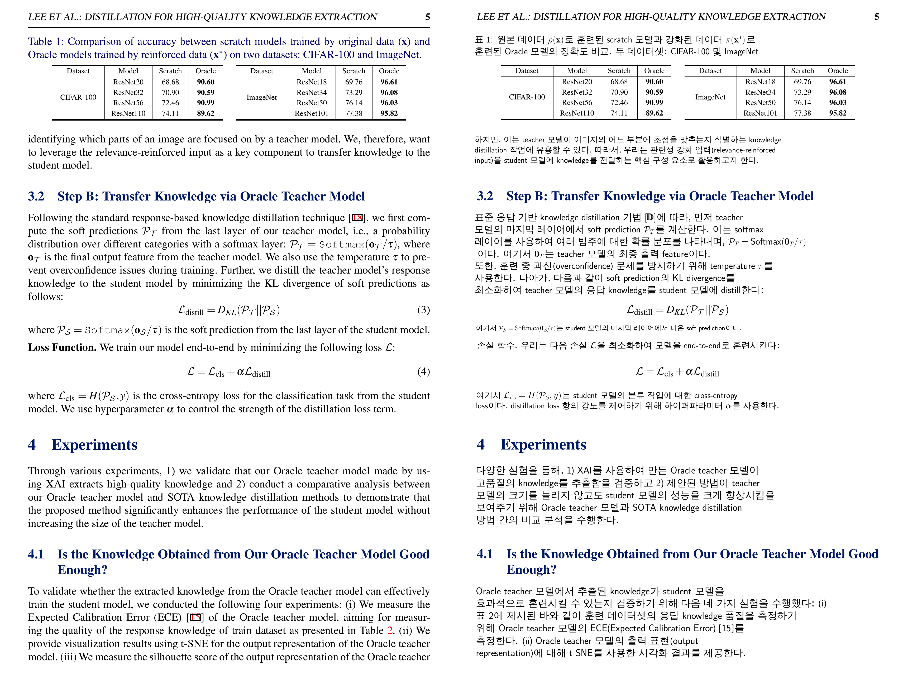

# Document Translator

Document Translator using DocParser([MinerU](https://github.com/opendatalab/MinerU)).





# Installation
Strongly recommend using a virtual environment such as conda.

```
conda create --name translator python=3.11
conda activate translator
```
Install all required dependencies:
```
./install.sh
```
## Prepare API Key

Place your Gemini API key inside the file `API_KEY.txt`.  
The program will automatically read the key from this file at runtime.


# Usage
Run the translator by specifying the input PDF path and output directory:
```
python translate_mineru.py \
    --pdf_path <input_path> \
    --output_dir <output_dir> \
    --save_origin_image \
    --save_md
```

## Optional Flags
- **`--source_language <name>`**  
  Source language of the document.  
  **Default:** `English`

- **`--target_language <name>`**  
  Target language for translation.  
  **Default:** `Korean`

- **`--font_path <path>`**  
  Font file path used for rendering translated text and math.  
  **Default:** `./fonts/GmarketSansTTFLight.ttf`

- **`--save_origin_image`**  
  Save original PDF-to-image conversion results.

- **`--save_md`**  
  Save the final translated content as Markdown.

- **`--use_mathtex`**  
  Render math using MathTeX instead of XeLaTeX.

- **`--save_parsing_results`**  
  Save intermediate parsing results as JSON.
